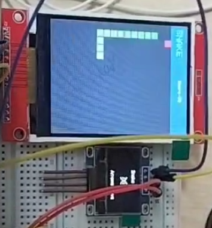
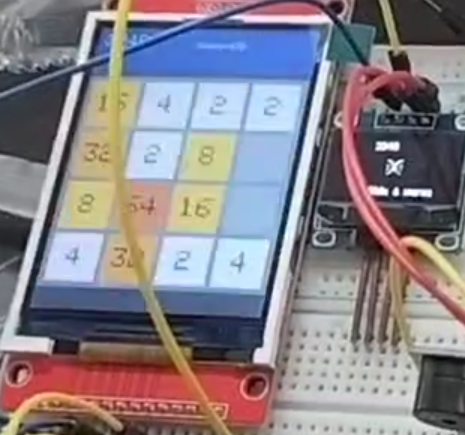

# 附录：实物调通后的调整与完善工作（个人负责部分）

> 说明：本项目的硬件选型、电路搭建、原理图设计与基础功能框架由小组成员共同完成并验证通过（详见正文第 6 章"实物搭建与调试"）。在实物点亮、基础功能跑通之后，**本人主要承担了后续的功能完善、交互体验优化与稳定性问题修复**等迭代工作。这部分工作量较为零散，但贯穿了"发现问题 → 分析原因 → 修改验证"的完整工程闭环，故单列于附录详细记录。
>
> 本附录按工作类型分为四个方面：钢琴模块的深度打磨、操作体验优化、稳定性问题修复、扩展模块的需求驱动与联调。每一项均按"动机/现象 → 分析 → 改动 → 验证"的方式记录。

---

## 一、钢琴模块的深度打磨

钢琴节奏游戏是本项目投入精力最多、迭代次数最多的模块。它最初只是一个简单的"四轨下落"原型，经过多轮调整，逐步完善为一个可玩、可听、有难度分级的完整节奏游戏。这一模块也延续了我们早期在 C51 平台上"用方波播放音乐"的设计思路。

### 1.1 判定时机与下落视觉的对齐

**现象**：原型阶段，音符方块在视觉上明明已经落到判定线，但按下去却判 Miss；或者还没到线就能得分。判定时机与玩家看到的画面不一致，手感很差。

**分析**：根因是"音符位置"和"判定时刻"用了两套不一致的计算。画面里方块的 Y 坐标按帧累加，而判定却用绝对时间戳比较，二者没有统一到同一个物理模型上。

**改动**：重新推导了**坐标-时间公式**，把"音符到达判定线的时刻"严格等同于"该音符的预定节拍时刻 `tick`"：

```cpp
// 音符在 tick 时刻正好落到判定线; 之前在上方, 之后继续下落
float yf = JUDGE_LINE_Y + (float)(gameTime - (int64_t)note.tick) * PX_PER_MS;
```

其中 `PX_PER_MS = JUDGE_LINE_Y / APPROACH_MS`，表示每毫秒下落的像素数。这样"画面位置"和"判定时间"由同一个公式驱动，视觉与判定彻底对齐。

**验证**：方块压线的瞬间按键即判 Perfect，手感恢复正常。

【预留图位 1：钢琴游戏运行画面，可标注判定线位置】



<!-- APPEND -->

### 1.2 难度分级

**动机**：固定难度无法兼顾"新手想慢慢玩"和"熟手想要挑战"。

**改动**：增加进入游戏前的难度选择界面（Easy / Normal / Hard），三档难度同时调整三个参数——判定窗口宽度、音符下落速度：

```cpp
case 0: PERFECT_MS=150; GOOD_MS=240; BAD_MS=340; APPROACH_MS=2800.0f; break; // 慢+宽松
case 1: PERFECT_MS=120; GOOD_MS=200; BAD_MS=280; APPROACH_MS=2200.0f; break; // 普通
case 2: PERFECT_MS=70;  GOOD_MS=120; BAD_MS=160; APPROACH_MS=1400.0f; break; // 快+严格
```

简单难度下音符落得慢、判定窗口宽，新手也能跟上；困难难度下落得快、窗口窄，考验反应。

**验证**：三档难度实机体验差异明显，Easy 适合演示，Hard 适合挑战。

### 1.3 从"四个固定音"到"真实旋律"的重构

这是钢琴模块改动最大的一次，也最能体现"发现问题—推翻重做"的过程。

**现象**：最初的设计是"四条轨道固定对应四个音高"，例如小星星只用 `C4 E4 G4 C5` 四个音。实机一听，**根本听不出是什么歌**——因为小星星的真实旋律是 `1 1 5 5 6 6 5`，里面有 La 等音，只用四个音根本凑不成完整曲调。

**分析**：问题出在数据结构上。原来每个音符只记录"它在第几条轨道"，音高靠查一张"轨道→音高"的固定表得到。这意味着**一首歌全程只能发出四个音**，旋律自然残缺。

**改动**：从根上重构——让**每个音符直接携带自己的真实音高**，而不是靠轨道反查。数据结构从原来的"只有轨道"改为带音高字段：

```cpp
struct NoteProto {
  uint32_t tick;      // 起始时刻(ms)
  uint8_t  pitch;     // 真实音高索引 (0=C4 1=D4 ... 12=A5)
  uint8_t  type;      // 0=点击 1=长按
  uint32_t duration;  // 该音持续时长(ms)
};
```

然后把六首曲目（小星星、生日快乐、欢乐颂、铃儿响叮当等）按简谱逐个音符重写，并按音高高低自动映射到显示轨道（低音靠左、高音靠右），旋律起伏时方块自然左右错落。配合音频驱动新增的"按时值发声"接口，音符长短也跟着节拍走，听起来更连贯。

**验证**：重构后，进入游戏即可自动演奏出可辨认的完整旋律，切换曲目能明显听出是不同的歌。

> 这一改动说明：**数据结构的设计决定了功能的上限。**"四轨四音"的结构从一开始就限定了表现力，靠微调参数救不回来，只能推翻重做。

【预留图位 2：钢琴游戏多首曲目选择/演奏画面】

---

## 二、操作体验优化

实物做出来之后，只有亲手拿着玩，才能发现一堆仿真阶段感觉不到的"别扭"。这部分改动都来自真实的操作体验反馈。

### 2.1 方向键扩展为九宫格布局

**动机**：原本方向控制只绑定在 A/B/C/D 四个键上，但矩阵键盘上 A/B/C/D 在最右一列，单手操作时按起来很别扭，不符合直觉。

**改动**：参考手机九宫格的方向习惯，把方向键**额外**绑定到数字键 **2/4/6/8**（2=上、8=下、4=左、6=右），与原 A/B/C/D 并存。玩家可以用更顺手的一组。

**验证**：贪吃蛇、俄罗斯方块、2048 等需要频繁转向的游戏，用 2/4/6/8 操作明显更顺手。

### 2.2 射击键失灵问题

**现象**：飞机大战里，快速操作时偶尔会"按了射击键却没发子弹"。

**分析**：定位到主循环里**按键处理被放在了帧率限制之后**——当某一帧因为帧率门限被跳过时，这一帧里的按键事件也跟着被丢弃了。

**改动**：把按键事件的读取与处理**提前到帧率限制之前**，保证每次按键都被响应，只有画面渲染受帧率约束。

**验证**：连续快速点射不再丢键。

> 这是一个典型的"逻辑顺序"问题：**输入响应不应该被渲染帧率绑架**。仿真里因为速度快不容易复现，实机快速操作才暴露出来。

<!-- APPEND2 -->

### 2.3 菜单适配多功能滚动显示

**动机**：随着功能模块不断增加（从最初 3 个增加到 10 个），主菜单一屏显示不下。

**改动**：把主菜单改为**可滚动列表**，固定显示若干项，上下选择时列表自动滚动，并在顶部/底部用箭头提示还有更多项。

**验证**：10 个功能项可以流畅上下浏览，选中项高亮清晰。

【预留图位 3：主菜单滚动列表运行画面】

---

## 三、稳定性问题修复

### 3.1 欠压复位（BROWNOUT）导致的连锁问题

**现象**：游戏过程中偶发**白屏闪动、蜂鸣器乱响、画面突然跳回菜单**，尤其在"得分发声 + 刷屏"同时发生时。

**分析**：连上串口监视器，捕获到复位原因 `rst:0xf (BROWNOUT_RST)`，确认是**欠压复位**——彩屏背光、蜂鸣器、刷屏的瞬时电流尖峰把供电电压拉垮，触发芯片的掉电保护。

**改动（软件侧减负）**：

1. **去掉开机提示音**——上电瞬间供电最紧张，此时再叠加蜂鸣器电流极易触发欠压；
2. **降低待机时 OLED 刷新频率**，减小平均电流；
3. 配合硬件侧改用更强的电源供电（手机充电头）。

**验证**：改进后串口复位原因变回正常的 `rst:0x1 (POWERON)`，不再反复重启。

> 这个问题是软硬件结合排查的典型：软件能做的是"削峰"——减少瞬时电流叠加；但根治还要靠供电裕量。

### 3.2 全局数据放置不当引发的启动异常

**现象**：在一次给钢琴模块新增曲目数据后，烧录后设备**反复 BROWNOUT 重启，连开机画面都进不去**。

**分析**：排查发现，新增的曲目相关数据中有数组没有正确声明为常量/只读（PROGMEM），导致本应放在 Flash 的大块只读数据被放进了 RAM，加重了启动阶段的内存初始化负担。

**改动**：把曲目名表等只读数据显式声明为 `PROGMEM`（放入 Flash），读取时用 `pgm_read_ptr` 等方式从 Flash 取出：

```cpp
static const char* const songNames[MAX_SONGS] PROGMEM = { ... };
// 读取时:
const char* namePtr = (const char*)pgm_read_ptr(&songNames[idx]);
```

**验证**：重新编译烧录后正常启动。

> 经验：嵌入式平台 RAM 宝贵，**只读数据要明确放 Flash**，否则可能在意想不到的环节（如启动初始化）出问题。这类问题在 PC 上几乎不会遇到，是嵌入式特有的。

<!-- APPEND3 -->

### 3.3 中文工程路径导致的链接失败（构建环节）

**现象**：源码全部编译通过，但最后**链接阶段报错**，提示无法创建 `.map` 文件。

**分析**：工程目录路径含中文（"各学科作业…"），而 GNU 链接器 `ld.exe` 在 Windows 下处理非 ASCII 路径有缺陷，无法写出 `.map` 文件。

**改动**：`.map` 文件只是内存布局分析用，对固件本身无影响。编写了构建脚本 `disable_map.py`，在链接前移除 `-Wl,-Map=...` 选项绕过该缺陷。关键是脚本必须挂在 `post:` 时机（框架添加选项之后再移除），用 `pre:` 无效：

```ini
extra_scripts = post:disable_map.py
```

**验证**：链接通过，正常生成固件 `.bin`。

---

## 四、扩展模块的需求驱动与联调

实物跑通后，我们围绕"一个能学也能玩的掌机"这个定位，陆续补充了一批模块。这部分本人主要负责**提出需求、确定交互方式、并在实机上联调验收**——把"想要什么效果"翻译成具体的功能要求，再在真机上反复试玩、调整细节。

### 4.1 防沉迷：游戏时长限制

**动机**：定位是"学习+娱乐"一体机，不希望沉迷游戏，于是提出加入时长限制。

**实现要点**：连续游戏累计达到设定时长（10 分钟）后，自动弹出提醒并踢回主菜单；**学习类模块不受此限制**。

**联调**：实机验证到点能正确弹窗并返回菜单，且只对游戏类模块生效。

### 4.2 学习模块（背单词 / 数学速算 / 记忆翻牌）

**动机**：为强化"学习"属性，提出加入几个轻量学习模块。

**交互确定**：

- **背单词**：确定为"翻卡片 + 选择题"两种模式，内置词表；
- **数学速算**：随机生成四则运算题，键盘输入作答；
- **记忆翻牌**：4×4 卡牌配对，锻炼记忆。

**联调**：逐个在实机上试用，确认按键响应、计分、答对/答错反馈（含蜂鸣器提示音）正常。

### 4.3 OLED 动态表情

**动机**：副屏原本只显示静态状态，希望它"活"起来，增加趣味。

**实现要点**：把一组表情图片转换为单片机可用的位图格式，在不同场景（待机、命中、连击、结算）显示对应表情；钢琴模式下按特定组合键还能触发全屏角色动画。

**本人参与**：参与了表情素材的整理与场景对应关系的设计，并在实机上验证不同状态下表情切换正确、刷新不卡顿（同时也是 3.1 节欠压问题的考量点之一——表情刷新要控制频率）。

【预留图位 4：副屏 OLED 表情显示实拍】



### 4.4 多游戏模块的合并与联调

**动机**：扫雷、贪吃蛇、俄罗斯方块、2048 等模块在不同分支/版本中分别开发，需要合并到统一的菜单框架下。

**本人参与**：负责审查各版本的差异（配色、按键约定、新增模块），把它们统一接入主菜单状态机，并解决合并后按键约定不一致、配色风格不统一等问题，最后在实机上逐个模块回归测试。

---

## 五、工作小结

这部分"调整与完善"工作虽然分散，但可以归纳为一条主线：

> **基础功能跑通 ≠ 项目完成。** 真正耗时的是实机暴露出来的体验问题、稳定性问题，以及围绕产品定位不断补充、打磨功能的迭代过程。

| 工作类型 | 典型事项 | 工程方法 |
| --- | --- | --- |
| 功能打磨 | 钢琴判定对齐、难度分级、旋律重构 | 推导物理模型、重构数据结构 |
| 体验优化 | 九宫格方向键、射击丢键、菜单滚动 | 实机试玩驱动的迭代 |
| 稳定性修复 | 欠压复位、PROGMEM 放置、链接失败 | 串口诊断、嵌入式资源约束 |
| 需求驱动 | 防沉迷、学习模块、动态表情、模块合并 | 需求定义 + 实机联调验收 |

这些工作让我体会到：**嵌入式开发中，"在真机上反复试、反复调"是不可替代的一环**，很多问题只有亲手拿着设备操作才会暴露，也只有在真机上验证过才算真正解决。

---

> 【图片清单备忘（排版时核对，可替换为实拍）】
>
> - 图位 1：钢琴判定线画面
> - 图位 2：钢琴曲目演奏画面
> - 图位 3：主菜单滚动列表
> - 图位 4：OLED 表情实拍
>
> 注：本附录已复用部分正文已有实拍图（钢琴运行、双屏协同），其余图位建议补充实机截图或照片。


