# ESP32-S3 多功能学习游戏一体机

## ——基于微机接口原理的嵌入式系统设计、仿真与实物调试报告

> 课程：微机接口原理
>
> 选题：嵌入式人机交互系统设计与实现
> 关键词：矩阵键盘扫描 · SPI/I²C 总线接口 · PWM 驱动 · woki仿真 · 实物联调

---

## 摘要

本项目以课程所学的微机接口技术为核心，设计并实现了一台基于 ESP32-S3 的多功能掌上学习游戏一体机。系统集成 **ILI9341 彩色 LCD（SPI 接口）+ SSD1306 OLED（I²C 接口）双屏显示、4×4 矩阵键盘（GPIO 行列扫描）、无源蜂鸣器（PWM 驱动）** 四大外设，软件上实现钢琴节奏、飞机大战、扫雷、贪吃蛇、俄罗斯方块、2048、番茄计时等多个功能模块。

我们学到的不仅在功能本身，更在于**工程实现的全过程**：技术方案选型的论证、Proteus 原理图设计与 Wokwi 功能仿真的双平台协同、以及从仿真到实物联调中遇到的一系列真实问题（屏幕不亮、接口错位、供电欠压等）的排查与解决。这些问题的诊断与修复，正是对"微机接口原理"课程知识的综合运用。

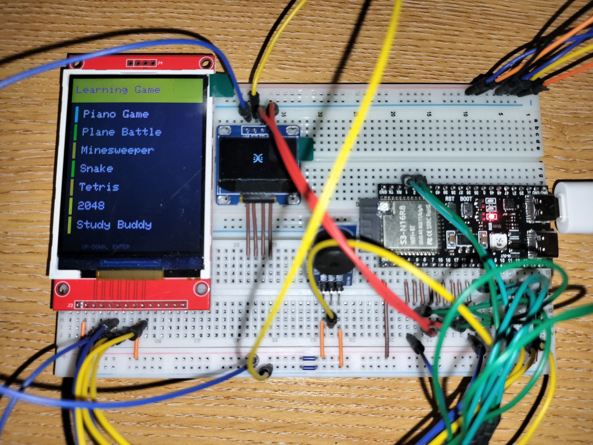

【图 0：实物整机运行照片 —— 主菜单点亮、双屏工作（预留，使用最终运行效果图）】

---

## 目录

1. 项目概述与设计目标
2. 技术方案选型：为什么是 ESP32 而非 C51
3. 系统硬件架构与接口原理应用
4. 仿真平台：Proteus 原理图设计 + Wokwi 功能仿真
5. 从代码到仿真到实物的完整实现流程
6. 实物搭建与调试全过程（核心）
7. 软件设计思路与接口原理的对应
8. 功能验证与运行效果
9. 总结：课程知识的综合运用与反思

---

## 1. 项目概述与设计目标

### 1.1 选题动机

微机接口原理课程的核心，是理解 CPU 如何通过各类接口（并行/串行总线、GPIO、定时器/PWM、中断等）与外部设备交换信息。课内以 C51（8051 内核单片机）为教学载体，配合 Keil 编译与 Proteus 仿真，讲授了键盘接口、显示接口、定时计数、串行通信等基本原理。

为了把这些"接口"知识用在一个**完整、可交互、有综合性**的系统上，我们选择做一台集成多种典型外设的"游戏一体机"。它一次性涵盖了课程的几乎所有接口类型：

| 课程知识点         | 在本项目中的体现                        |
| ------------------ | --------------------------------------- |
| 键盘接口与行列扫描 | 4×4 矩阵键盘，逐行拉低、读列、软件消抖 |
| 串行总线 SPI       | ILI9341 彩色 LCD 的数据/命令传输        |
| 串行总线 I²C      | SSD1306 OLED 的双线通信（0x3C 地址）    |
| 定时器 / PWM       | 无源蜂鸣器发声（不同频率方波）          |
| 串行通信 UART      | 烧录与调试日志输出（115200 波特率）     |
| 程序状态机         | 多游戏模式切换、各游戏内部状态管理      |

### 1.2 设计目标

- 双屏显示：主屏跑游戏画面，副屏显示状态/表情（验证两种不同串行接口的并存）；
- 矩阵键盘统一操控全部功能（验证 GPIO 行列扫描接口）；
- 蜂鸣器音效反馈（验证 PWM 定时输出接口）；
- 多个独立游戏模块，通过菜单状态机统一调度。

---

## 2. 技术方案选型：为什么是 ESP32 而非 C51

### 2.1 应用需求对硬件提出的要求

本项目主屏采用 240×320 的 ILI9341 彩色屏，若要流畅运行游戏，需要：

- **帧缓冲（Framebuffer）**：240×320 像素 × 每像素 16 位（RGB565）= **150 KB** 显存。
- **运算能力**：游戏需 ~60 FPS 实时刷新、碰撞检测、音符判定等。

而经典 C51（如 STC89C52）的资源是：**RAM 仅 256 字节 + 扩展 1~2 KB，ROM 8 KB 量级，主频 12~33 MHz，8 位运算**。

> 简言之：**150 KB 的帧缓冲，C51 内存连零头都放不下**。C51 能点亮字符型 LCD1602、做简单的段码显示，但无法承载彩色图形游戏所需的帧缓冲与实时运算。使用C51系类无法完成这个项目。

### 2.2 ESP32-S3 的对应能力

| 指标  | 经典 C51          | ESP32-S3     | 本项目需求         |
| ----- | ----------------- | ------------ | ------------------ |
| RAM   | ~256 B + 少量扩展 | 512 KB SRAM  | ≥150 KB（帧缓冲） |
| 主频  | 12~33 MHz         | 240 MHz 双核 | 60 FPS 实时刷新    |
| Flash | 8 KB 级           | 8/16 MB      | 多游戏 + 字库      |
| 运算  | 8 位              | 32 位        | 浮点判定、坐标运算 |

ESP32-S3 用充裕的 RAM 容纳帧缓冲、用 240 MHz 主频支撑实时性，恰好补齐了 C51 的短板。

### 2.3 接口原理一脉相承

**最重要的一点**——尽管换了芯片，本项目用到的接口技术，都是课内 C51 教学中讲过的同一套原理：

- **矩阵键盘**：C51 用 P1/P2 口做行列扫描，ESP32 用 GPIO 做行列扫描，**算法完全一样**（逐行拉低、读列、消抖）。
- **PWM 蜂鸣器**：C51 用定时器中断翻转 I/O 产生方波，ESP32 用 LEDC 硬件 PWM 产生方波，**"用方波频率决定音调"的本质相同**。
- **SPI / I²C**：都是课内讲的同步串行总线，时钟+数据线、主从时序，ESP32 只是把它做进了硬件外设。
- **UART**：115200 波特率串口通信，与课内串行口章节一致。

> 因此本项目可以理解为：**用课程学到的接口原理，迁移到一个资源更强的平台上，去实现 C51 受限于资源而做不到的综合应用**。芯片是工具，接口原理才是内核。

### 2.4 编程环境的对应关系

| 环节      | C51 教学环境  | 本项目环境                       | 说明                                   |
| --------- | ------------- | -------------------------------- | -------------------------------------- |
| 编辑/编译 | Keil µVision | PlatformIO + Arduino 框架        | 都是 C/C++ 语言，本项目主体仍是 C 风格 |
| 仿真      | Proteus       | Proteus（原理图）+ Wokwi（功能） | 见第 4 节                              |
| 烧录      | 编程器/ISP    | USB 直连烧录                     | 原理同为把机器码写入 Flash             |
| 调试      | 串口/仿真     | 串口监视器（115200）             | 完全一致                               |

> 注：C51 用 C 语言、ESP32 用 C/C++，二者在"寄存器/引脚操作、位运算、状态机"层面**高度相通**；差异主要在 ESP32 提供了更多现成的硬件外设驱动库。所以编程思维是延续的，不是另起炉灶。

第二章总结

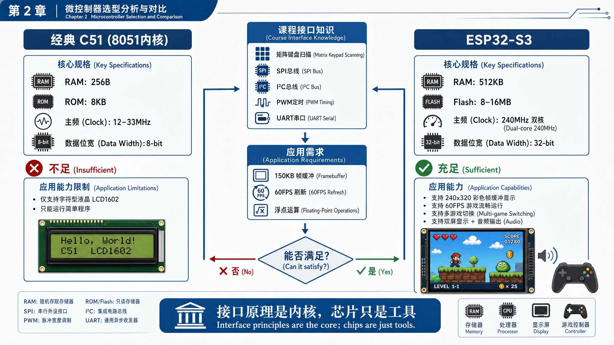

---

## 3. 系统硬件架构与接口原理应用

### 3.1 系统框图

```
                    ┌─────────────────────────┐
                    │      ESP32-S3 主控        │
                    │   (240MHz 双核, 512KB RAM) │
                    └─────────────────────────┘
       SPI │            I²C │          GPIO │         PWM │
           ▼                ▼              ▼             ▼
   ┌──────────────┐  ┌────────────┐  ┌──────────┐  ┌──────────┐
   │ ILI9341 彩屏  │  │ SSD1306    │  │ 4×4 矩阵 │  │ 无源蜂鸣器│
   │ 240×320 主屏  │  │ OLED 副屏   │  │  键盘     │  │          │
   └──────────────┘  └────────────┘  └──────────┘  └──────────┘
```

【图 1：系统硬件框图（可用上面 ASCII 框图重绘为美观版，或保留）】

### 3.2 引脚分配表（实物接线依据）

> 说明：本表是**实物接线的唯一权威依据**。项目初期 README 文档中的引脚表与代码不一致，调试中以代码 `config.h` 为准并最终统一（详见第 6 节调试过程）。

| 模块          | 接口类型 | 信号              | ESP32-S3 引脚           |
| ------------- | -------- | ----------------- | ----------------------- |
| ILI9341 彩屏  | SPI      | CS / DC / RST     | GPIO 10 / 4 / 8         |
|               |          | MOSI / SCK / MISO | GPIO 11 / 12 / 13       |
|               | 电源     | VCC / LED背光     | 3V3                     |
| SSD1306 OLED  | I²C     | SDA / SCL         | GPIO 6 / 7（地址 0x3C） |
| 4×4 矩阵键盘 | GPIO     | 行 ROW1~4         | GPIO 1 / 2 / 3 / 5      |
|               |          | 列 COL1~4         | GPIO 14 / 15 / 16 / 17  |
| 无源蜂鸣器    | PWM      | 信号 IO           | GPIO 18                 |

### 3.3 各接口的原理说明（课程知识）

**(1) 4×4 矩阵键盘 —— 行列扫描接口**

16 个按键若用独立 I/O 需要 16 根线，矩阵法用"4 行 × 4 列 = 8 根线"即可，节省一半引脚。这正是课内"矩阵键盘"章节的核心：

- 4 根行线设为输出，4 根列线设为输入上拉；
- 逐行拉低，读列电平：若某列被拉低，则该行该列交叉点的按键被按下；
- 配合软件消抖（延时二次确认）消除机械抖动。

**(2) ILI9341 彩屏 —— SPI 同步串行接口**

SPI 是课内讲的同步串行总线：主机产生时钟 SCK，数据沿 MOSI 送出，配合 CS（片选）、DC（数据/命令区分）、RST（复位）控制显示器。本项目在 ESP32 端用 GFXcanvas16 在内存里建立 150KB 帧缓冲，整帧通过 SPI 推送到屏幕。

**(3) SSD1306 OLED —— I²C 双线接口**

I²C 仅用 SDA（数据）+ SCL（时钟）两根线，靠 7 位设备地址（0x3C）寻址。与 SPI 同屏并存，正好验证了"两种串行总线在同一系统中协同工作"。

**(4) 无源蜂鸣器 —— PWM 定时输出接口**

无源蜂鸣器靠外部方波驱动，**方波频率 = 音调高低**。课内用定时器中断翻转 I/O 产生方波；本项目用 ESP32 的 LEDC 硬件 PWM 输出指定频率的方波，原理一致——都是"用定时/PWM 产生特定频率信号"。

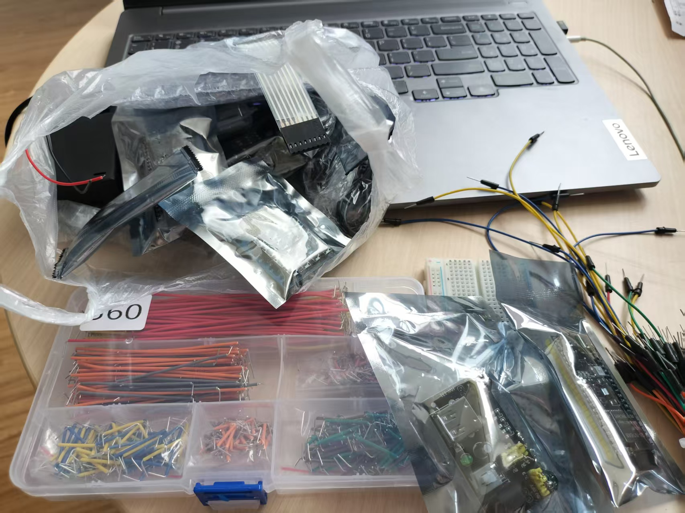

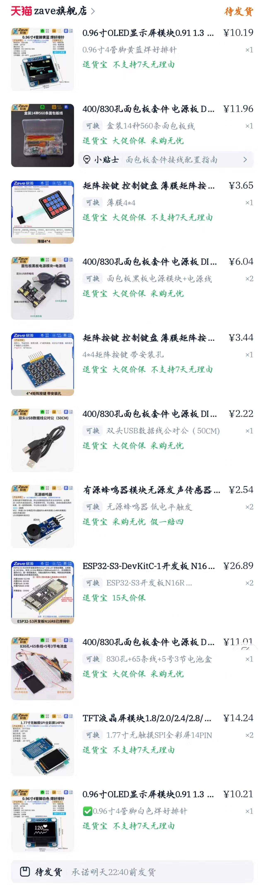

【图 2：实物元件清单照片（ESP32 开发板、两块屏、键盘、蜂鸣器、面包板等，预留）】

---

第三章总结

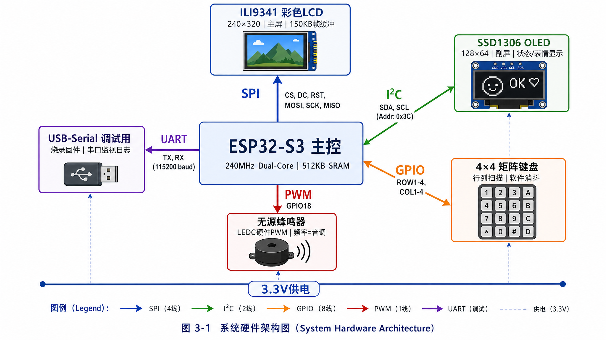

## 4. 仿真平台：Proteus 原理图设计 + Wokwi 功能仿真（双平台协同）

仿真是本项目从"代码"走向"实物"之间的关键桥梁。由于本项目的特殊性（主控为 ESP32-S3），我们采用了**两个仿真平台分工协作**的策略。

### 4.1 为什么不能只用 Proteus

课内使用 Proteus 对 C51 做电路原理图设计 + 功能仿真，二者一体。但本项目遇到一个现实限制：

> **Proteus 的元件库里没有 ESP32-S3 这颗芯片的仿真模型。** Proteus 擅长 8051/AVR/PIC 等经典单片机，对 ESP32 这类较新的、带 Wi-Fi 的 SoC 缺乏官方仿真模型。

因此无法在 Proteus 里直接"运行" ESP32 的程序看游戏画面。但这不代表 Proteus 没用——我们让它承担它最擅长、也是课程最看重的工作：**接口电路原理图设计与引脚规划**。

### 4.2 Proteus 的作用：接口电路原理图 + 引脚对应表（替代元件法）

我们在 Proteus 中用**功能等价的替代元件**搭建了接口电路原理图，完成引脚级的连接规划：

| 真实元件          | Proteus 替代元件        | 替代理由                  |
| ----------------- | ----------------------- | ------------------------- |
| ESP32-S3 开发板   | 71918-14（排针/接插件） | 等价表达 ESP32 的引脚排布 |
| ILI9341 TFT 14PIN | 25631401RP2             | 同为 14 脚 SPI 显示接口   |
| SSD1306 OLED 4PIN | CONN-SIL4               | 同为 4 脚 I²C 接口       |
| 4×4 矩阵键盘     | KEYPAD-SMALLCALC        | 同为矩阵按键结构          |
| 无源蜂鸣器        | 25630301RP2（3脚）      | 同为 3 脚蜂鸣器接口       |

通过这种"理论元件↔真实元件引脚对应"的方法，我们在 Proteus 中：

1. 画出了完整的**接口连线原理图**（哪个引脚连哪个引脚）；
2. 整理出**引脚对应表**（理论符号引脚 ↔ ESP32 实际 GPIO），作为实物接线的施工图。

> 这正是课内 Proteus "电路原理图设计"环节的本职工作。**Proteus 在本项目中承担了接口电路的设计与验证，而非功能动画仿真**——这是对工具能力的合理取舍。

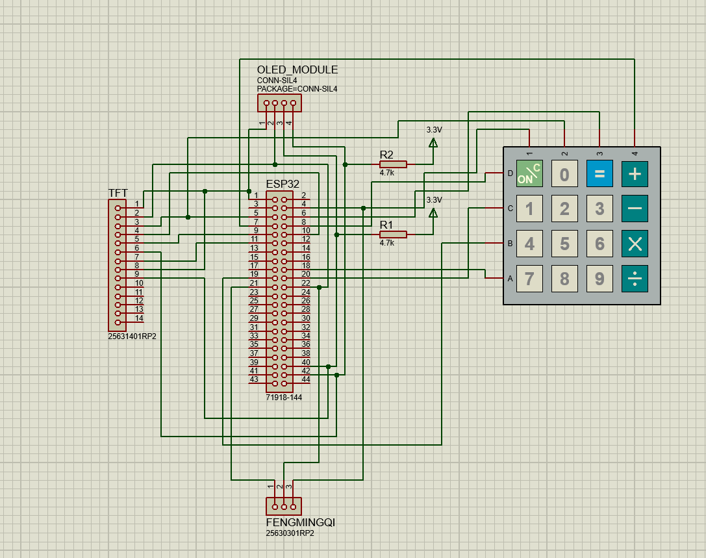

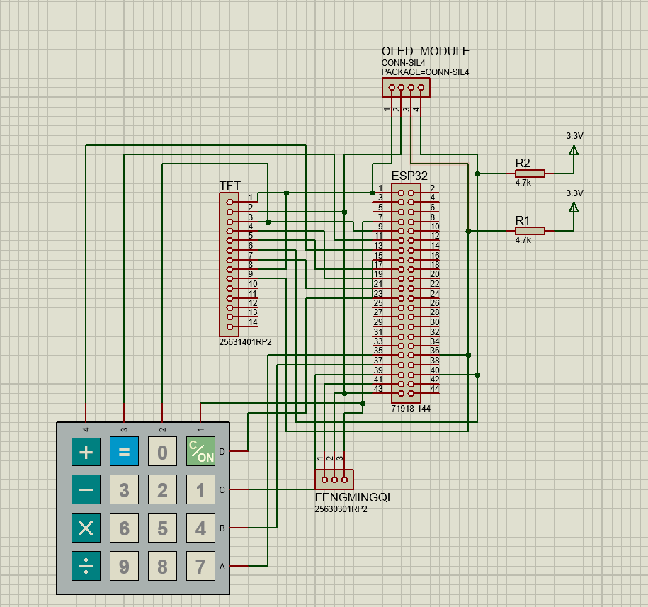

【图 3：Proteus 接口电路原理图（替代元件搭建，预留——使用 Proteus接线/接线1.png、接线2.png）】

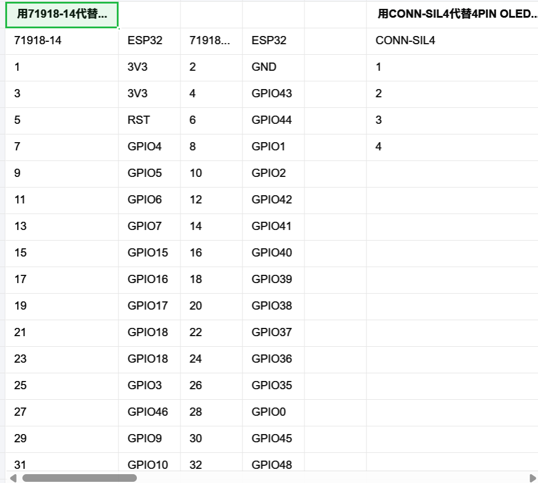

【图 4：理论元件与真实元件引脚对应表（预留——使用 Proteus接线/理论元件与真实元件的引脚的对应.xlsx 截图）】

### 4.3 Wokwi 的作用：功能级仿真验证

对于"程序逻辑是否正确、游戏画面是否如预期"，我们使用支持 ESP32-S3 的在线仿真平台 **Wokwi**（VS Code 插件形式）：

- 它有 ESP32-S3、ILI9341、SSD1306、矩阵键盘、蜂鸣器的完整仿真模型；
- 用 `diagram.json` 描述电路连接，`wokwi.toml` 指定固件；
- **关键：Wokwi 的连接关系与 Proteus 原理图、与实物接线三者完全一致**（同一套引脚分配）。

工作流是：先在 Wokwi 里跑通程序逻辑、确认游戏画面正常，再去做实物——这样实物阶段就只需排查"硬件/接线"问题，而不必怀疑"程序对不对"。

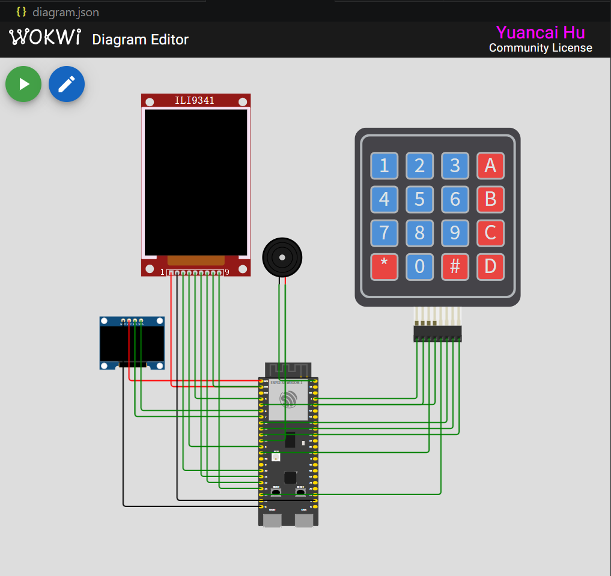

【图 5：Wokwi 仿真运行截图（菜单/某游戏画面，预留）】

### 4.4 双平台分工小结

| 平台              | 承担工作                         | 对应课程环节                           |
| ----------------- | -------------------------------- | -------------------------------------- |
| **Proteus** | 接口电路原理图设计、引脚对应规划 | 电路设计/原理图                        |
| **Wokwi**   | 程序功能仿真、画面/交互验证      | 功能仿真（因 ESP32 模型只有 Wokwi 有） |
| **实物**    | 真实接线、联调、解决工程问题     | 实操与接口调试                         |

三者层层递进、互相印证：Proteus 定接线 → Wokwi 验程序 → 实物做联调。

---

## 5. 从代码到仿真到实物的完整实现流程

整体实现路线如下，每一步都为下一步提供经过验证的基础：

```
① 接口原理分析  →  ② 代码实现  →  ③ 编译生成固件  →  ④ Wokwi功能仿真
                                                              ↓
   ⑧ 实物联调  ←  ⑦ 烧录固件  ←  ⑥ 实物接线  ←  ⑤ Proteus原理图/引脚表
```

### 5.1 工程组织

项目用 PlatformIO 管理，目录结构清晰地体现了"接口驱动 + 应用逻辑"的分层：

```
include/                  src/
  config.h    引脚/键值定义   main.cpp        主程序+菜单状态机
  keyboard.h  键盘接口       keyboard.cpp    矩阵键盘行列扫描
  lcd_driver.h 彩屏接口      lcd_driver.cpp  ILI9341+帧缓冲
  oled_driver.h OLED接口     oled_driver.cpp SSD1306
  audio.h     音频接口       audio.cpp       PWM蜂鸣器
  piano_game.h ...          piano_game.cpp  各游戏逻辑
  (snake/tetris/game2048/minesweeper ...)
```

> 这种"底层接口驱动与上层应用分离"的结构，本身就是接口编程思想的体现：把"怎么和硬件打交道"封装成 `initKeyboard/scanKeyboard`、`lcdDrawString` 这样的接口函数，上层游戏只管调用，不关心寄存器细节。

### 5.2 编译与烧录环节遇到问题（链接器与中文路径）

在第一次编译时就遇到一个真实问题，值得记录，因为它体现了对工具链的理解：

- **现象**：所有源文件都编译通过，但最后**链接阶段失败**，报错 `cannot open map file ... No such file or directory`。
- **诊断**：观察报错路径，发现工程目录含中文（"各学科作业…"），而 ESP32 使用的 GNU 链接器 `ld.exe` 在 Windows 下处理**非 ASCII 路径有缺陷**，无法创建 `.map` 文件。
- **解决**：`.map` 文件只是内存布局分析用，对固件本身无影响。编写一个 PlatformIO 构建脚本 `disable_map.py`，在链接前移除 `-Wl,-Map=...` 选项，绕过该缺陷。
- **关键细节**：脚本必须用 `post:` 时机挂载（在框架添加该选项之后再移除），用 `pre:` 无效——这需要理解 PlatformIO/SCons 的构建阶段顺序。

> 这一步说明：嵌入式开发中，"编译能过"不等于"能生成固件"，工具链的每个环节（编译→汇编→链接→生成 bin）都可能出问题，要会看报错、定位到具体环节。

### 5.3 仿真先行的意义

固件生成后，先在 Wokwi 跑通——确认菜单、各游戏画面、按键响应、蜂鸣器音效在仿真里全部正常。**这一步把"软件正确性"锁定下来**，于是进入实物阶段后，凡是出问题，就能把怀疑范围集中在"硬件与接线"上，大大缩短了排查时间（见第 6 节）。

第五章总结图：

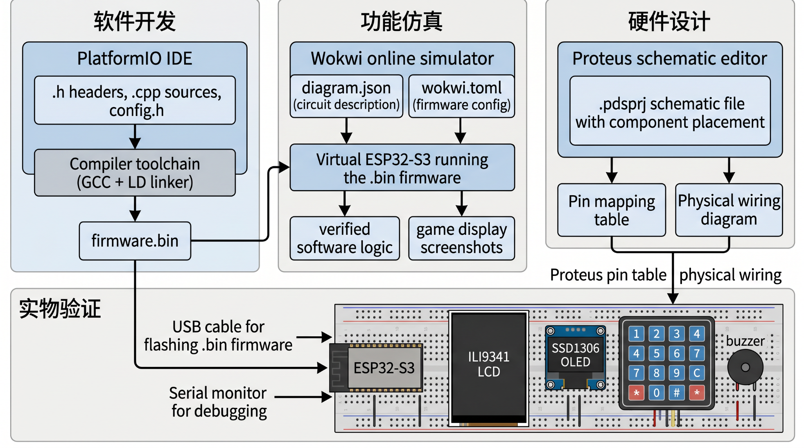

---

## 6. 实物搭建与调试全过程（核心）

本节是报告重点。实物阶段我们用面包板免焊搭建，按"先接线 → 通电 → 逐个点亮外设 → 联调"的顺序推进。过程中遇到 5 个典型问题，每个的排查思路都直接用到了接口原理与电路常识。下面按时间顺序记录。

### 6.1 第一阶段：完成接线，仿真能跑但屏幕不亮

按 Proteus 引脚对应表把各模块接到面包板上，ESP32 上电（板载蓝色电源灯亮），程序也烧录成功，仿真里一切正常——**但实物的彩色主屏不亮**。

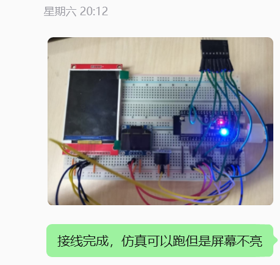

【图 6：第一次接线完成的实物照片（预留——用户记录："接线完成，仿真可以跑但是屏幕不亮"，对应聊天图1）】

> 此时的判断逻辑：仿真已验证程序正确 ⇒ 问题在硬件侧。屏幕不亮，先怀疑供电与接口。

### 6.2 第二阶段：发现两个接线/供电问题

逐项排查后定位到两个问题：

**问题 1：USB 接口插错口。** ESP32-S3 开发板有两个 USB-C 口——一个是芯片**原生 USB（USB-Serial-JTAG）**，一个是板载 **CH343 桥接芯片的 UART/COM 口**。我们最初插的是原生 USB 口，导致烧录/供电行为与预期不符。改插标有 COM 的 UART 口后，串口与供电恢复正常。

**问题 2：两块面包板的电源轨没有联通。** 我们用了两块面包板，但两块板的电源轨（正负母线）之间没有用跳线连起来，导致接在第二块板上的模块（副屏）根本没有取到电。把两块板的 + 轨与 − 轨分别用跳线连通后，副屏点亮。

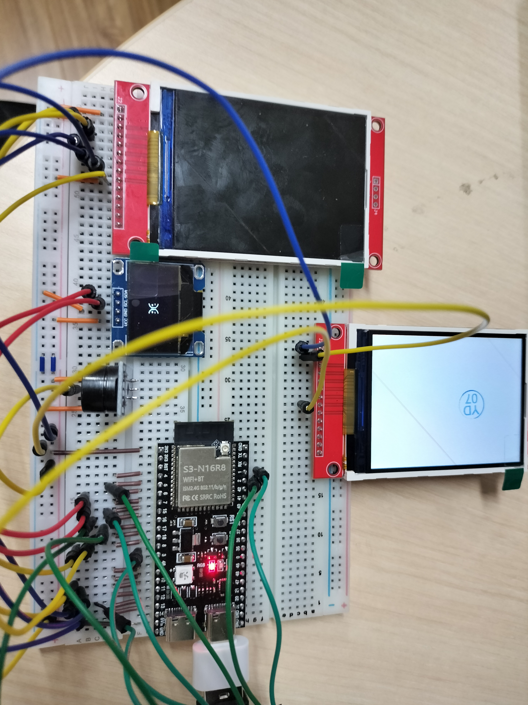

【图 7：发现接口与电源问题、副屏点亮后的实物照片（预留——对应聊天图2，"问题1：接口有误…问题2：两块面包板电源柜没有联通"）】

> 这一步是典型的供电回路问题：模块要工作，必须 VCC 与 GND 都接入**同一个供电网络**。面包板电源轨中间常常是断开的，跨板供电必须显式联通——这是电路连通性的基本常识。

### 6.3 第三阶段：大屏仍不亮 —— 接口错位（逐线复查法）

副屏亮了，但**彩色大屏（ILI9341）依然不亮**。此时我们采取了系统化的排查方法：

> **排查方法：另取一块同型号屏，对照引脚丝印，逐根线重新接、逐根核对。**

通过逐线比对，最终发现根因是**接口错位**——之前接线时是"按引脚的物理位置从上往下数"来接的，而 ILI9341 模块不同批次的引脚丝印顺序并不完全一致，"数位置"导致整排引脚错位，SPI 的 CS/DC/SCK 等关键信号没接对，屏自然不亮。


【图 8：排查大屏不亮、逐线重接的实物照片（预留——对应聊天图3，"大屏不亮，排查方法是再找一块逐一接线，最后发现是接口错位造成的"）】

**经验教训（已写入项目文档）**：

> 两块板子并排照着接很容易接错，**一定要先拍摄/记录模块背面的引脚分布图，按丝印名称（CS/DC/SCK…）接线，而不是数物理位置。**
>
> 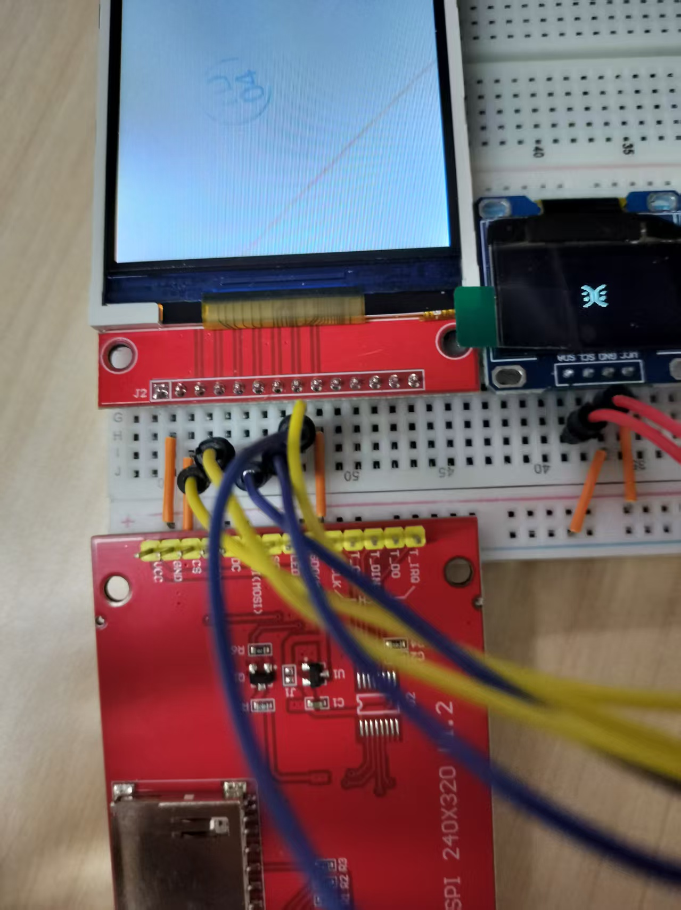

【图 9：屏幕引脚丝印特写照片（预留——对应聊天图4，"2块板子这样照着接不容易接错，或者一定要提前拍摄背面的引脚分布图"）】

### 6.4 第四阶段：确认键盘映射（串口监视调试法）

大屏点亮、菜单出现后，进入功能联调。曾怀疑矩阵键盘的按键映射不对（按某键功能不符）。我们用**串口监视调试法**确认：

- 烧入一个专门的键盘自检程序，每次按键通过 UART 打印出"实际触发的行号、列号、键值"；
- 逐个按下 16 个键，对照串口输出，验证 `keyMap[行][列]` 映射表是否正确。

结果证实键盘行列扫描与映射**完全正常**（按 9 → 收到 KEY_FIRE，按 1/2/3 → 收到对应键值等），从而排除了键盘嫌疑，把问题定位到上层游戏逻辑。

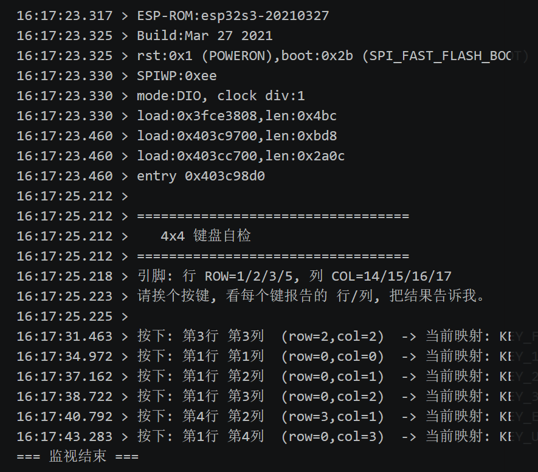

【图 10：串口监视器打印的按键调试日志截图（预留——可截 VS Code 串口监视器输出）】

> 这一步是 UART 串行通信接口的典型应用：**用串口把单片机内部状态"打印"出来，是嵌入式调试最基本也最有效的手段**，等价于课内"用串口观察程序运行状态"。

### 6.5 第五阶段：白屏闪动 + 蜂鸣器间断 —— 供电欠压（BROWNOUT）

功能基本跑通后，出现一个更隐蔽的问题：**屏幕偶发白屏闪动、蜂鸣器间断地响、操作时画面"跳回"**。

排查方法依然是 UART：连上串口监视器观察复位原因，捕获到关键信息：

```
rst:0xf (BROWNOUT_RST)
```

**`BROWNOUT_RST` = 欠压复位**。芯片内置的掉电检测电路发现供电电压跌破阈值，自动复位保护。每次复位都会：重新初始化 LCD（白屏闪）、重播上电流程（蜂鸣器间断响）、回到开机菜单（画面跳回）。

**根因分析**（用到电源/负载的电学常识）：

- 所有外设（尤其 ILI9341 的**背光 LED 是耗电大户**）都从 ESP32 板载 3.3V 稳压器取电；
- 电脑 USB 口供电能力本就有限；
- 当"刷屏 + 蜂鸣器发声"在同一瞬间发生（如游戏得分时），**瞬时电流尖峰**把电压拉垮，触发欠压复位。

**解决措施（软硬件结合）**：

1. 软件减负：去掉上电瞬间的开机提示音（上电时供电最紧张，避免叠加蜂鸣器电流）；降低待机时 OLED 的刷新频率，减小平均电流。
2. 硬件供电：改用**手机充电头（5V/1A 以上）供电**替代电脑 USB 口，提供更强的电流裕量。

改进后，串口复位原因变回正常的 `rst:0x1 (POWERON)`（仅上电一次），不再反复重启。

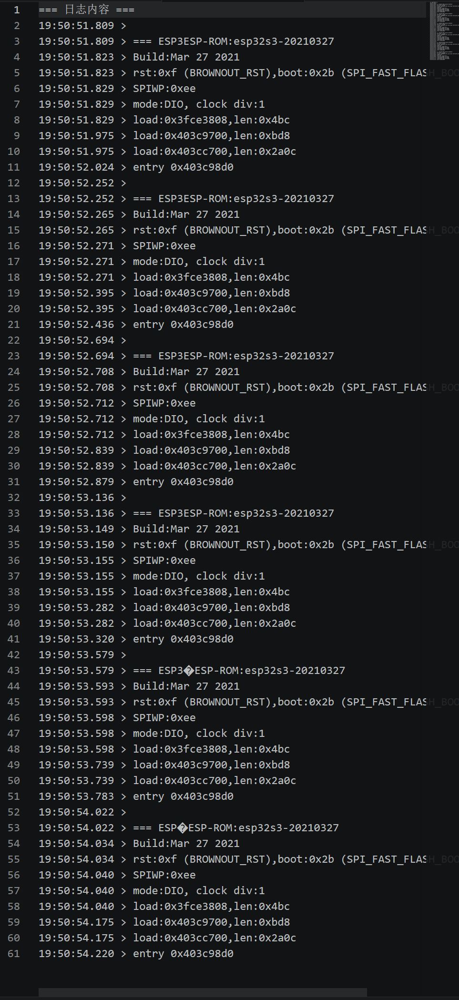

【图 11：串口捕获到 BROWNOUT_RST 的日志截图（预留）】

> 这一步综合了"电源接口/供电能力"与"复位机制"的知识：单片机系统不仅要逻辑对，还要**保证供电能扛住峰值电流**，否则会触发欠压保护。这是从"仿真"到"实物"才会暴露的真实工程问题——仿真里没有供电限制，实物里电源就是硬约束。

### 6.6 调试过程汇总表

| # | 现象                   | 排查方法                  | 根本原因                     | 解决                    | 用到的知识             |
| - | ---------------------- | ------------------------- | ---------------------------- | ----------------------- | ---------------------- |
| 1 | 编译过但链接失败       | 看报错路径                | 中文路径致 ld 无法写 .map    | 构建脚本移除 -Map 选项  | 工具链/编译链接流程    |
| 2 | 屏幕不亮               | 先排除软件（仿真已过）    | 见 3、4                      | ——                    | 故障定位思路           |
| 3 | 供电/烧录异常          | 区分两个 USB 口、查电源轨 | 插错 USB 口 + 跨板电源未联通 | 改插 COM 口、联通电源轨 | 串行链路识别、供电回路 |
| 4 | 大屏黑屏               | 逐线复查、对照丝印        | SPI 接口引脚错位             | 按丝印重接              | SPI 信号定义与时序     |
| 5 | 按键疑似不对           | 串口打印行列键值          | 实为正常（排除嫌疑）         | 定位到上层逻辑          | UART 调试              |
| 6 | 白屏闪+蜂鸣器乱响+跳回 | 串口看复位原因            | BROWNOUT 欠压复位            | 软件减负+换强电源       | 供电能力、复位机制     |

> 总结下来：**先用仿真锁定软件正确性，再用串口/逐线法把问题逐步收敛到具体硬件环节**，每一步都有依据，不靠盲试。

---

## 7. 软件设计思路与接口原理的对应

代码用 C/C++ 编写，整体延续了 C51 单片机编程"初始化外设 → 主循环轮询 → 状态机调度"的思路。下面挑几个最能体现接口原理的部分说明设计思路（这些思路都是由课内知识直接引出的）。

### 7.1 矩阵键盘扫描（行列扫描法）

设计思路完全来自课内"矩阵键盘"章节：初始化时 4 行设为输出、4 列设为输入上拉；扫描时逐行拉低、读列，配合时间戳消抖。核心代码：

```c
void initKeyboard() {
  for (int i=0;i<4;i++){ pinMode(rowPins[i],OUTPUT); digitalWrite(rowPins[i],HIGH);}
  for (int i=0;i<4;i++)  pinMode(colPins[i], INPUT_PULLUP);   // 列上拉
}

uint8_t scanKeyboard() {
  if (millis() - lastDebounce < DEBOUNCE_MS) return KEY_NONE;  // 软件消抖
  for (int row=0; row<4; row++){
    digitalWrite(rowPins[row], LOW);          // 逐行拉低
    for (int col=0; col<4; col++)
      if (digitalRead(colPins[col]) == LOW){  // 该列被拉低 → 按键按下
        ...返回 keyMap[row][col];
      }
    digitalWrite(rowPins[row], HIGH);
  }
}
```

> 这与 C51 用 P1/P2 口做矩阵键盘的逻辑**一模一样**，仅把 `P1=0xFE` 这种端口操作换成了 `digitalWrite`。消抖也是课内强调的"机械抖动需软件延时确认"。

### 7.2 PWM 蜂鸣器发声（定时输出）

无源蜂鸣器靠方波驱动，**频率决定音调**。课内用定时器中断翻转 I/O；本项目用 LEDC 硬件 PWM 输出指定频率方波，并将音效设计为**非阻塞状态机**（避免发声时阻塞游戏画面）：

```c
void playTone(uint16_t freq, ...) { ledcWriteTone(AUDIO_CHANNEL, freq); ... }
// 音符频率表: C4=523, D4=587, E4=659 ... 与乐理一致
```

> 这一步把"定时器/PWM 产生特定频率信号"的接口知识，用到了"按音符频率发声"的应用上。后期为解决欠压问题，还从"降低发声引起的瞬时电流"角度对音效做了优化——这是接口知识与供电知识的结合。

### 7.3 SPI 帧缓冲显示

ILI9341 通过 SPI 接收像素数据。由于逐像素发送太慢，本项目在内存里建立 240×320 的 16 位帧缓冲（GFXcanvas16），所有绘制先写内存，再整帧经 SPI 推送到屏幕，提升刷新效率。

> 这体现了对 SPI 接口"批量传输优于逐字节传输"的理解，以及对显示接口数据组织（RGB565 像素格式）的掌握。

### 7.4 主程序：模式状态机

主程序用一个 `currentMode` 状态变量调度各功能模块，主循环根据当前模式分发按键、刷新画面——这是课内"程序状态机"思想的标准应用：

```c
switch (currentMode) {
  case MODE_MENU:        handleMenu(key); break;
  case MODE_PIANO:       pianoGameLoop(key); break;
  case MODE_SNAKE:       snakeGameLoop(key); break;
  ...
}
```

### 7.5 关于代码调试中的思维方式

代码从框架到联调，是一个"提出实现思路 → 编译验证 → 仿真验证 → 实物暴露问题 → 回到代码修正"的反复迭代过程。几个典型的、由调试驱动的代码修正：

- **音符判定与下落对齐**：钢琴游戏最初判定时机与屏幕判定线视觉不符，按照"音符到达判定线的时刻 = 得分时刻"的物理关系重新推导了坐标-时间公式，使判定窗口与视觉一致。
- **按键被帧率丢弃**：飞机游戏射击键偶发失灵，定位到"按键处理被放在帧率限制之后导致丢弃"，把按键事件处理提前到帧率限制之前。
- **方向键易用性**：根据实操体验，把方向键从 A/B/C/D 扩展为同时支持数字键 2/4/6/8（类似手机九宫格方向），更符合直觉。

## 8. 功能验证与运行效果

最终系统在实物上稳定运行，主菜单可在 7 个功能间切换，各模块均工作正常：

| 功能       | 操作方式                   | 验证的接口               |
| ---------- | -------------------------- | ------------------------ |
| 主菜单     | 上/下选择，确认进入        | 键盘 + 双屏              |
| 钢琴游戏   | 1/2/3/4 四轨，按中音符发声 | 键盘 + SPI 屏 + PWM 音   |
| 飞机大战   | 方向键移动，9 键射击       | 键盘 + 显示              |
| 扫雷       | 方向键移光标，揭开/插旗    | 键盘 + 显示 + Flash 存档 |
| 贪吃蛇     | 2/4/6/8 或 ABCD 转向       | 键盘 + 显示              |
| 俄罗斯方块 | 移动/旋转/下落             | 键盘 + 显示              |
| 2048       | 四方向滑动合并             | 键盘 + 显示              |
| 番茄计时   | 选时长，倒计时             | 显示 + 定时              |

资源占用：Flash 约 16.9%、RAM 约 10.2%（充足）。

【图 12：主菜单运行效果（预留——实拍）】


【图 13：钢琴游戏运行效果（预留——实拍）】

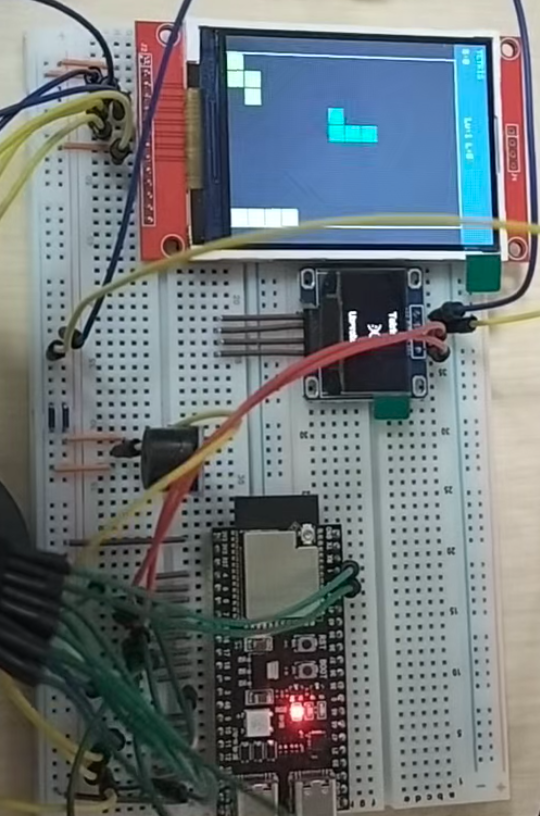
【图 14：扫雷/贪吃蛇/俄罗斯方块/2048 运行效果（预留——实拍，可多张）】

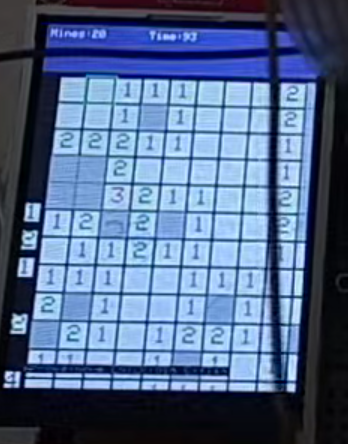


【图 15：双屏协同工作效果，副屏显示表情/状态（预留——实拍）】

---

## 9. 总结：课程知识的综合运用与反思

### 9.1 本项目对课程知识的运用

本项目虽然主控芯片从课内的 C51 换成了 ESP32-S3，但其内核——**微机接口原理**——是完全贯通的：

- **接口类型全覆盖**：矩阵键盘（GPIO 行列扫描）、SPI、I²C、PWM、UART，课程讲的接口几乎都用上了，且都是亲手接线、亲手调通的。
- **方法论的运用**：从原理分析到电路设计（Proteus），到功能仿真（Wokwi），到实物联调，是一条完整的工程链路。
- **真实问题的解决**：链接器路径问题、USB 口识别、SPI 接口错位、供电欠压，这些都是只有动手做实物才会遇到、且必须用接口与电路知识才能解决的问题。

### 9.2 关于平台选择的再认识

选用 ESP32 而非 C51，不是"逃避" C51，而是因为**应用的资源需求（150KB 彩色帧缓冲、60FPS 实时性）客观上超出了 8051 内核的物理能力**。但这恰恰反过来印证了课程的价值：**接口原理是平台无关的**——我们把 C51 上学到的行列扫描、PWM、串行总线知识，原封不动地迁移到了更强的平台上。芯片是会过时的，接口原理不会。

### 9.3 实物调试的最大收获

仿真和实物之间隔着一道"工程鸿沟"。仿真里：电源是理想的、引脚是自动对齐的、没有接触不良。而实物里：

- 引脚要靠人按丝印一根根接对（接口错位 → 黑屏）；
- 电源要扛得住峰值电流（欠压 → 反复重启）；
- 接口要插对物理端口（USB 口识别）。

> **最大的体会是：把仿真做对只是第一步，把实物调通才是真正的工程。** 而调通的过程，靠的不是运气，是"先锁定软件、再逐项排查硬件、每步都用原理找依据"的系统方法。

### 9.4 后续可改进方向

- 给彩屏背光加限流/独立供电，从硬件上根治欠压；
- 把矩阵键盘换成手感更好的按键键盘；
- 增加更多外设接口（如 ADC 摇杆、I²C 传感器）以覆盖更多接口类型。

---

## 附录

- **A. 引脚对应表**：见第 3.2 节 / `include/config.h`
- **B. Proteus 原理图与引脚对应表**：`Proteus接线/` 目录
- **C. 仿真配置**：`diagram.json`（Wokwi 电路）、`wokwi.toml`
- **D. 上手操作教程**：`上手教程.html`（面向使用者的图文操作指南）
- **E. 源码结构**：见第 5.1 节

---

> 【图片清单备忘（供排版时核对）】
>
> - 图 0/12-15：最终运行效果（实拍，待补）
> - 图 1：系统框图
> - 图 2：元件清单
> - 图 3-4：Proteus 原理图 + 引脚对应表
> - 图 5：Wokwi 仿真截图
> - 图 6-9：实物搭建/调试过程（已有聊天记录照片 4 张）
> - 图 10-11：串口调试日志截图
